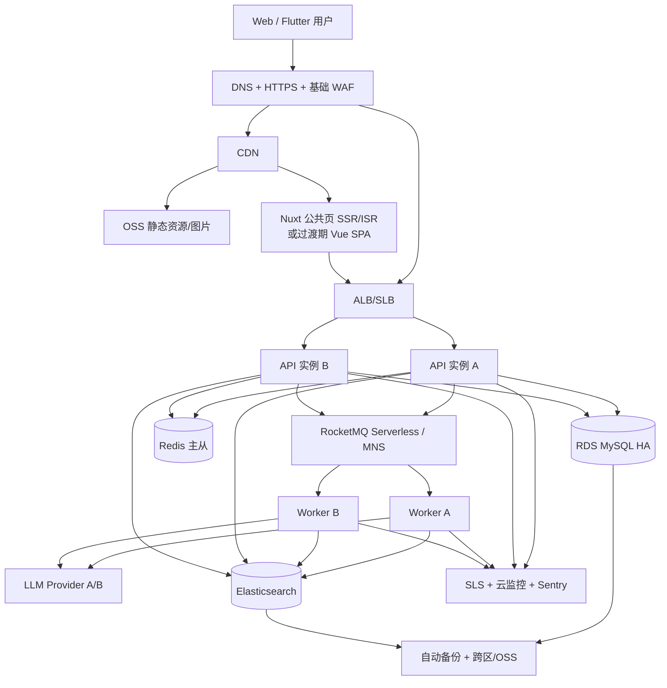

# Nexora AI 项目分析、千人在线架构与商业化方案

> 分析日期：2026-07-22<br>
> 目标窗口：未来 6 个月<br>
> 容量目标：峰值约 1,000 人同时在线（CCU）<br>
> 成本口径：人民币含税前估算；云厂商地域、带宽计费、活动折扣和合同价差异很大，采购前必须以阿里云控制台询价为准。本文的成本区间用于架构决策，不是报价单。

## 1. 执行摘要

### 1.1 核心结论

Nexora AI 已经是一个具备真实业务链路的功能型 MVP，而不是只有文档和脚手架：Java 多模块单体、Vue Web、Flutter App、RSS 采集、AI 多语言分析、搜索、推荐、收藏、订阅、Docker/K3s 和监控配置均已落地。

但是，当前版本还不宜直接面向付费用户公开上线。阻断上线的主要因素不是“性能不够”或“没有微服务”，而是生产安全、数据持久化、构建质量门禁、AI 任务可靠性、数据库热路径和内容合规仍有明显缺口。

最合理的半年方案是：

1. **继续采用模块化单体，不拆完整微服务，不上 Nacos/Spring Gateway，不把 K8s 当作上线前提。**
2. **同一份后端镜像按运行角色拆成 API 与 Worker 两类进程**，实现独立扩缩容和故障隔离，但仍共享代码库、数据库与发布版本。
3. **生产数据使用阿里云托管 RDS 与 Redis**；前端静态资源进入 OSS/CDN；两台跨可用区 ECS 承载 API/Worker；搜索初期可单独自建 ES，并保证可降级、可重建。
4. **1,000 CCU 的推荐设计目标不是 1,000 RPS**。按新闻阅读产品的行为模型，建议按 100～150 RPS 峰值设计，验收 200 RPS 持续、400 RPS 短时突发和 1,000 VU 在线场景。
5. **优先解决 P0 风险后再推广和收费**。当前存在公开管理接口、硬编码 JWT 密钥、AI 调用长事务、消息异常被吞、K3s 数据盘为 `emptyDir`、前端构建失败等问题。
6. **产品先聚焦“AI 新闻理解 + 每日简报 + 关键词提醒”**，不要在半年内同时做 Insight、企业情报、AI Chat、语音、完整微服务等所有方向。
7. **推荐基础设施固定成本约 ¥2,800～¥6,200/月**；加上流量、AI 和营销后，正常经营月成本约 ¥4,000～¥12,000。若直接购买三节点托管 ES 或大规模投放，成本会明显上升。

### 1.2 当前成熟度判断

| 维度 | 当前判断 | 半年目标 |
|---|---:|---:|
| 核心产品闭环 | 70% | 95% |
| 工程与模块边界 | 75% | 90% |
| 性能与容量证据 | 35% | 90% |
| 高可用与灾备 | 25% | 85% |
| 安全 | 30% | 90% |
| 可观测性 | 65% | 85% |
| SEO/增长基础 | 25% | 85% |
| 会员与支付 | 5% | 80% |
| 内容与数据合规 | 15% | 85% |

**综合定位：功能型 MVP，尚未达到生产发布门槛。**

---

## 2. 现有实现分析

## 2.1 已具备的有效资产

### 后端

- 采用单 Spring Boot 应用、Maven 多模块和清晰的模块边界，当前体量下是正确选择。
- 用户、新闻、采集、AI、搜索、收藏、订阅、推荐等主链路已有实现。
- MySQL 表具有基础唯一键和查询索引，Flyway 已建立迁移链路。
- Redis、RocketMQ、Elasticsearch 都有代码级接入，并提供无 ES/MQ 的 slim 模式。
- Prometheus、Grafana、Sentry、ELK、k6 等工具已留下集成基础。

### Web 与 App

- Vue 3、Pinia、Element Plus、多语言、暗黑模式、登录、新闻流、详情、搜索和用户中心已实现。
- Flutter 使用 Riverpod、GoRouter、Dio 和安全存储，工程方向合理。
- 现有 Web 组件可以在后续迁移 Nuxt 公共页面时复用，不需要推倒重来。

### 部署与交付

- 已有 Dockerfile、Compose、K3s 清单和 ACR 镜像流程。
- 后端和前端清单都配置了两个副本与健康探针，这是良好起点。
- 镜像已生成 SHA 标签，具备演进成不可变发布的基础。

## 2.2 关键问题与证据

### P0：上线前必须修复

| 问题 | 代码/配置证据 | 影响 | 建议 |
|---|---|---|---|
| 管理端点完全公开 | [SecurityConfig.java](backend/nexora-app/src/main/java/com/nexora/config/security/SecurityConfig.java#L24) 对 `/api/v1/admin/**` 使用 `permitAll()` | 任意人可触发批量 AI 回填，造成费用攻击和数据变更 | 管理端必须 RBAC + MFA/IP 白名单；默认不暴露公网 |
| 管理接口有 SQL 拼接 | [AdminAIController.java](backend/nexora-module-ai/src/main/java/com/nexora/ai/controller/AdminAIController.java#L63) 将 `langCode` 拼进 `NOT EXISTS`，`limit` 也通过 `last()` 拼接 | SQL 注入、资源滥用 | 语言使用枚举白名单；分页/limit 严格限定；改成参数化 Mapper SQL |
| JWT 密钥硬编码 | [JwtUtils.java](backend/nexora-common/src/main/java/com/nexora/common/utils/JwtUtils.java#L19) | 源码泄露即可伪造所有用户 Token | 从 KMS/Secret 注入，支持密钥版本与轮换，启动时拒绝默认值 |
| Access/Refresh Token 类型未校验 | [JwtUtils.java](backend/nexora-common/src/main/java/com/nexora/common/utils/JwtUtils.java#L31) 写入 `type`，但 [UserServiceImpl.java](backend/nexora-module-user/src/main/java/com/nexora/user/service/impl/UserServiceImpl.java#L99) 刷新时只校验签名和过期 | Access Token 可被拿来刷新；黑名单写入但认证链未读取 | 严格校验 `type/aud/iss/jti`；Refresh Token 轮换并检查撤销状态 |
| K3s 数据不持久 | [infrastructure.yaml](deploy/k3s/infrastructure.yaml#L51) 的 MySQL 和 [同文件](deploy/k3s/infrastructure.yaml#L148) 的 ES 使用 `emptyDir` | Pod 重建即丢库或丢索引 | 生产禁止使用该清单承载数据；改用 RDS/Redis 托管，ES 使用云盘/PVC + OSS 快照 |
| AI 外部调用处于数据库事务中 | [AIAnalysisService.java](backend/nexora-module-ai/src/main/java/com/nexora/ai/service/AIAnalysisService.java#L65) 开启事务后，在 [第 76 行](backend/nexora-module-ai/src/main/java/com/nexora/ai/service/AIAnalysisService.java#L76) 发起 7 次 LLM 调用 | 长时间占用连接，AI 变慢会耗尽连接池并拖垮 API | “短事务领取任务 → 无事务调用 AI → 短事务保存结果”；API/Worker 分池 |
| AI HTTP 无超时/重试/熔断 | [DeepSeekProvider.java](backend/nexora-module-ai/src/main/java/com/nexora/ai/provider/DeepSeekProvider.java#L23) 直接 `new RestTemplate()` | 上游卡住会无限占线程；无供应商容灾 | 设置连接/读/总超时；Resilience4j 重试、熔断、限并发、降级；至少双 Provider |
| MQ 消费异常被吞 | [AITaskConsumer.java](backend/nexora-module-ai/src/main/java/com/nexora/ai/consumer/AITaskConsumer.java#L40) 捕获异常后正常返回 | Broker 认为消费成功，任务永久丢失 | 可重试异常必须抛出；配置最大重试、DLQ、告警和人工重放 |
| 前端依赖锁曾不同步（已修复） | [package.json](frontend-web/package.json#L25) 引用了 `@sentry/vue`，原 `package-lock.json` 未包含它；2026-07-22 已执行 `npm install` 更新锁文件 | 原状态会导致 CI/Docker 构建失败 | 已用 `npm ci` 全量重装并再次 `npm run build`，生产构建通过；CI 继续强制该流程 |
| CI 实际跳过后端测试 | [ci.yml](.github/workflows/ci.yml#L33) 和 [同文件](.github/workflows/ci.yml#L85) 都使用 `-DskipTests` | 文档中的质量门禁并未执行 | 增加单测、集成、E2E、覆盖率、镜像扫描、迁移验证和 staging 冒烟 |

### P1：1,000 CCU 前必须完成

| 问题 | 证据与分析 | 改造 |
|---|---|---|
| 新闻列表 N+1 查询 | [NewsServiceImpl.java](backend/nexora-module-news/src/main/java/com/nexora/news/service/impl/NewsServiceImpl.java#L94) 对每条新闻转换；转换内分别查询来源、分类和 i18n（[第 320 行](backend/nexora-module-news/src/main/java/com/nexora/news/service/impl/NewsServiceImpl.java#L320)）。20 条列表约产生 61 次 SQL | 使用联表/批量 `IN` 查询，一页固定 2～4 次 SQL；VO 专用 Mapper，不对每条记录查库 |
| Redis 列表缓存可能无法命中 | [RedisConfig.java](backend/nexora-app/src/main/java/com/nexora/config/RedisConfig.java#L27) 将值按 `Object.class` JSON 反序列化且未写类型信息，而读取端要求 `cached instanceof PageResult` | 很可能读回 `LinkedHashMap` 后被当作未命中；必须用指标验证 | 使用明确 DTO 类型或字符串 JSON；增加 `cache_hit/cache_miss` 指标与测试 |
| 缓存失效使用 `KEYS` | [NewsCacheManager.java](backend/nexora-module-news/src/main/java/com/nexora/news/cache/NewsCacheManager.java#L34) | Key 多时会阻塞 Redis | 使用版本号 Key、Tag Set 或 `SCAN + UNLINK`；TTL 加随机抖动和单飞锁 |
| 阅读数同步写库且会丢计数 | [NewsServiceImpl.java](backend/nexora-module-news/src/main/java/com/nexora/news/service/impl/NewsServiceImpl.java#L114) 查出后 `+1` 再全行更新 | 每次详情都写 DB；并发覆盖 | Redis `INCR` 聚合，定时批量落库；或数据库原子 `view_count=view_count+1` |
| 推荐存在 N+1 与同步计算 | 每个收藏再次 `selectById`，每次请求扫描最多 200 候选并在 JVM 排序 | 登录用户增多后 DB/CPU 放大 | 行为异步采集，兴趣向量缓存，候选集预计算；首期按用户类别缓存 5～15 分钟 |
| ES 故障不是真正降级 | [SearchServiceESImpl.java](backend/nexora-module-search/src/main/java/com/nexora/search/service/impl/SearchServiceESImpl.java#L42) 捕获异常后返回空列表，MySQL 实现只在启动时按配置二选一 | ES 运行时故障等同“无搜索结果” | 抽出 ES 与 MySQL 两个 Repository，业务层按熔断状态运行时 fallback |
| 多副本会重复调度采集 | 两个后端副本均包含 `@Scheduled`；slim 调度器见 [NewsCollectSchedulerSlim.java](backend/nexora-module-crawler/src/main/java/com/nexora/crawler/scheduler/NewsCollectSchedulerSlim.java#L57) | 重复抓取、重复 AI 消费和并发去重竞态 | API 进程关闭 scheduler；Worker 使用 ShedLock/DB lease，只允许一个调度主实例 |
| Docker JVM 参数未生效 | [backend/Dockerfile](backend/Dockerfile#L21) 使用 exec 形式 `java -jar`，不会读取清单中的 `JAVA_OPTS` | 以为设置了堆大小，实际未传入 | 使用 `JAVA_TOOL_OPTIONS` 或明确 entrypoint 参数 |
| 发布使用 `latest` | [backend-deployment.yaml](deploy/k3s/backend-deployment.yaml#L25) 使用 `latest` + `IfNotPresent` | 节点可能不拉新镜像，无法审计和可靠回滚 | 只部署 Git SHA/镜像 digest；保留最近 10 个版本，一键回滚 |
| 无 HPA/PDB/反亲和 | 当前清单只有副本和滚动更新 | 两副本可能落在同一节点；维护时同时不可用 | ECS/ACK 场景配置跨区、反亲和、PDB 和基于 CPU/RPS 的扩容策略 |

### P2：商业化前完成

- 邮箱/手机验证、找回密码、注销账号、设备管理、登录限速与异常登录提醒。
- 支付订单、支付回调幂等、退款、权益、额度、发票与对账。
- 内容来源授权、转载范围、删除/更正机制、AI 内容标识和投诉通道。
- 新闻详情 canonical、OpenGraph、JSON-LD、站点地图、RSS、服务端渲染或静态化。
- Web 埋点、漏斗、留存、渠道归因和 A/B 实验开关。
- App API 地址环境化；生产关闭请求体/响应体日志。[api_client.dart](app/lib/services/api_client.dart#L10) 当前仍为 localhost 且会打印网络内容。

## 2.3 测试与“已完成”状态的真实判断

仓库具备后端集成/单元测试和 13 个 Playwright 场景。本次已经完成可复现验证，结果如下：

- CI 后端任务明确跳过测试，且没有 Playwright、覆盖率、SonarQube 或依赖扫描 Job。
- `tests/k6` 中有脚本，但没有提交可核验的结果报告；主脚本峰值仅 100 VU，不能证明 1,000 CCU。
- 本次前端首次生产构建因 Sentry 依赖与锁文件未同步而失败；执行 `npm install` 更新锁文件后，`npm run build` 通过。随后又执行 `npm ci` 全量重装并再次构建，1981 个模块生产打包成功，证明锁文件可复现。当前仅有主 JS chunk 约 1.17MB（gzip 约 390KB）的非阻断体积警告。
- 本次后端使用与 Dockerfile 一致的 `mvn package "-Dmaven.test.skip=true" -q` 已成功生成生产包，说明跳过测试源码编译时后端主代码可打包。
- 后端首次完整测试暴露了 Testcontainers import、自定义 ACR MySQL 镜像兼容声明和 test profile 外部服务隔离问题；已分别修复 [TestcontainersConfiguration.java](backend/nexora-app/src/test/java/com/nexora/TestcontainersConfiguration.java#L1) 与 [application-test.yml](backend/nexora-app/src/test/resources/application-test.yml#L1)。最终未跳过测试的 `mvn test` 结果为 Reactor 10/10 SUCCESS、35 tests、0 failures、0 errors、0 skipped，耗时约 33.5 秒。
- 尚未在本次会话重新执行 13 个 Playwright E2E，因此 E2E 状态仍应以 CI 中的新报告为准，而不能只依赖历史记录。

结论：`docs/TODO.md` 中“Phase 1 MVP 100%、0 failures、生产可部署”的说法应拆成：

- **功能清单完成度：较高；**
- **后端完整测试 35/35 通过、后端生产包成功、前端 `npm ci` 与生产构建通过；**
- **生产就绪度：未通过；**
- **1,000 CCU 容量：尚未验证。**

---

## 3. 对现有规划的剖析

## 3.1 规划中正确的部分

1. “模块化单体 → 热点模块拆分 → 微服务”的原则正确，适合当前团队与规模。
2. 新闻采集、AI、索引异步化的方向正确。
3. 产品从 News 切入，再扩 Daily 和 Insight，叙事连贯。
4. 数据模型已经为多语言、事件、标签、兴趣和行为预留空间。
5. Web 与 App 共用 API、Flutter 使用单代码库，投入产出比较合理。

## 3.2 规划中的主要误区

### 以时间而不是指标驱动架构演进

现有文档倾向于在 Phase 3 自动进入完整微服务。应改为指标触发：

- 单体发布频率或模块耦合开始阻碍团队；
- 某模块需要与 API 完全不同的资源和扩容曲线；
- 单模块故障持续拖垮全站；
- 单库容量、写入或合规隔离确有需要；
- 团队至少能为每个服务承担开发、值班、监控、发布和灾备成本。

对于 1,000 CCU，这些条件大多尚未出现。现在拆 5～8 个微服务会提高网络、数据一致性、部署和排障成本，不能提高用户价值。

### 把工具清单当作可靠性

Prometheus、Grafana、ELK、SkyWalking、K3s 全部装上，不等于系统可靠。当前最关键的是：

- 数据能否恢复；
- 构建能否稳定通过；
- AI/MQ 失败是否会重试或进入 DLQ；
- 告警是否能在 5 分钟内到人；
- 是否有经过演练的回滚和恢复步骤。

半年内应优先采用阿里云 SLS、云监控、RDS 备份等托管能力，减少自建 ELK 的运维负担。

### 产品范围过宽

现有 Phase 2 同时包含 Daily、推送、用户兴趣、语音、热点聚类，Phase 3 又加入 Insight、AI 研究助手和企业情报。对于半年窗口，建议只押注：

1. AI 新闻理解；
2. 事件追踪/聚合；
3. 个性化 Daily；
4. 关键词/实体提醒；
5. 可付费的多语言、导出与研究额度。

语音可以接云 TTS 作为 Plus 权益，但不应占用核心研发路径；企业情报应等个人版有留存后再验证。

### 缺少商业与合规里程碑

规划几乎只描述技术与功能，没有定义：目标用户、获取渠道、留存阈值、付费触发点、内容授权与中国大陆运营资质。新闻产品中，这些往往比 1,000 CCU 技术问题更早成为阻断项。

---

## 4. 1,000 人同时在线容量模型

## 4.1 正确定义“在线”

当前产品使用 HTTP + JWT，没有持续 WebSocket 连接。1,000 人同时打开页面不等于 1,000 个请求同时执行。

推荐采用以下容量假设：

| 参数 | 基线 | 压力值 |
|---|---:|---:|
| 峰值在线用户 | 1,000 CCU | 1,500 CCU |
| 同时活跃比例 | 15% | 25% |
| 活跃用户操作频率 | 1 次/5～10 秒 | 1 次/3 秒 |
| 平均 API RPS | 20～40 | 80～120 |
| 设计峰值 | 150 RPS | 200 RPS 持续 |
| 短时突发 | 300 RPS | 400 RPS/60 秒 |
| 读写比例 | 95:5 | 90:10 |
| 缓存命中目标 | ≥90% | ≥85% |

若用户所说的“1,000 并发”实际指 **1,000 个请求同时抵达**，则需要按 1,000 RPS 或更高单独设计，成本和验收方案至少提高一个档位，不能沿用本报告预算。

## 4.2 上线验收 SLO

| 指标 | Beta | 付费正式版 |
|---|---:|---:|
| 月可用性 | 99.5% | 99.9% |
| 首页/列表 P95 | <300 ms | <200 ms |
| 详情 P95 | <250 ms | <150 ms（不含外链正文） |
| 搜索 P95 | <800 ms | <500 ms |
| API 5xx | <1% | <0.3% |
| AI 处理成功率 | >97% | >99%（含重试） |
| AI 新文章处理延迟 P95 | <10 分钟 | <5 分钟 |
| RPO | ≤24 小时 | MySQL ≤5 分钟 |
| RTO | ≤2 小时 | 核心 API ≤30 分钟 |

## 4.3 压测方法

现有 k6 脚本是 100 VU、包含大量 `sleep` 的闭环模型，只能作为基础负载脚本。应新增：

1. `constant-arrival-rate`：50、100、200 RPS 各运行 15 分钟；
2. 突发：从 50 RPS 在 10 秒内升至 400 RPS，保持 60 秒；
3. 1,000 VU 在线场景：模拟浏览、详情、搜索、收藏的真实比例；
4. 2 小时 soak：100 RPS，观察堆、GC、连接池、线程、Redis、DB 慢查询；
5. Redis/ES/LLM 故障注入：验证降级，不只验证正常路径；
6. 所有压测结果归档到 CI Artifact，并记录镜像 SHA、数据量和云资源规格。

压测数据至少应有 10 万篇文章、5 种语言 i18n、1 万用户和足够行为记录，不能用 319 篇左右的小数据集代表生产。

---

## 5. 推荐的高可靠、高性价比架构

## 5.1 总体架构



## 5.2 保留模块化单体，但按进程角色隔离

仍使用同一个仓库、同一个 JAR、同一个版本，新增 Profile/Role：

- `api`：Controller、鉴权、新闻/用户/搜索查询；关闭 crawler scheduler 和 AI consumer。
- `worker`：采集、AI、索引、通知；关闭或不暴露业务 Controller。
- `migration`：发布前一次性执行 Flyway；不让所有副本同时迁移。

收益：

- API 不会因 LLM 阻塞、采集异常或批量回填而耗尽线程/连接。
- Worker 可以按 AI 积压独立扩容，不必复制整个对外 API 流量。
- 仍保持单体开发效率，无需引入服务发现、分布式事务和大量 RPC。

只有当 Worker 模块已形成独立团队或有显著不同的发布周期时，再物理拆服务。

## 5.3 数据与缓存热路径

### MySQL

- RDS MySQL 8.0 高可用版，起步 2C4G、100GB ESSD，开启 PITR/自动备份。
- API 每实例 Hikari 20～25；Worker 每实例 5～10；总连接预算不超过 RDS 可用连接的 40%。
- 列表采用 Keyset/Cursor 分页处理深页，避免大 offset。
- 一页新闻、来源、分类、i18n 使用专用 SQL 一次联表或 2～4 次批量查询。
- 新增 `source_url_hash` 唯一索引，去重不再依赖“先查后插”。
- 阅读/行为写入先进入 Redis/MQ，批量落库。

### Redis

- 使用 1～2GB 主从版，缓存内容可丢，不将其当唯一业务存储。
- 首页、分类列表、详情、推荐候选分别设定 TTL；热点 Key 预热。
- 防击穿：TTL 随机抖动 + 单飞锁；防雪崩：版本化命名空间切换。
- 限流、幂等键、登录失败计数、短期权益缓存统一规范过期时间。

### Elasticsearch

1,000 CCU 本身不要求三节点 ES，主要决定因素是文档数、搜索 QPS 和可用性。建议：

- **推荐起步**：单独一台 4C8G 搜索节点 + 100～200GB ESSD，ES 堆 3～4GB，每日快照到 OSS；索引可从 MySQL 全量重建。
- **升级条件**：搜索持续 >30 QPS、索引 >500 万文档、恢复时间 >30 分钟，或付费 SLO 要求搜索 99.9% 时，迁移阿里云托管 ES 三节点。
- API 必须具备运行时 MySQL 降级；降级搜索可以功能较弱，但不能返回假空结果。

### 消息队列

优先询价阿里云 RocketMQ Serverless，以减少现有代码改造；若最低消费不经济，则在消息抽象层下实现 MNS。无论使用哪种产品，都需要：

- 本地事务 + Outbox，避免“数据库成功但消息没发出”；
- 消费幂等；
- 指数退避重试；
- DLQ、积压与最老消息年龄告警；
- AI 任务限速和单文章成本上限。

不建议继续使用单 Broker、无持久盘的自建 RocketMQ 作为正式生产队列。

## 5.4 AI Gateway 的可靠性和成本设计

当前一篇新文章会进行 5 次语言摘要 + 1 次分类 + 1 次实体提取，即 **至少 7 次 LLM 调用**。这是未来最可能超过云主机成本的部分。

建议改为：

1. 一次结构化调用同时输出原文语言/中文摘要、分类、实体和事实；
2. 英文作为默认预生成的第二语言；
3. 日/韩/德按访问热度、用户订阅或付费权益异步生成；
4. 对相同内容 Hash、Prompt 版本、模型版本建立结果缓存；
5. 文章正文输入设置字符/Token 上限，先抽取正文再送模型；
6. 供应商 A/B 路由：便宜模型负责分类/翻译，高质量模型只处理高价值文章；
7. 每日 Token 预算、单来源预算、单用户研究额度和费用告警。

成本公式：

```text
月 AI 成本 = 每日新文章数 × 30 ×
  [每篇输入 Token / 1,000,000 × 输入单价
   + 每篇输出 Token / 1,000,000 × 输出单价]
```

示例仅用于量级判断：若当前方案每篇约 13K 输入、3.5K 输出，每日处理 300 篇，则每月约为 **117M 输入 Token + 31.5M 输出 Token**。将七次调用压到一到三次并延迟低需求语言，通常可降低 50%～80% AI 成本。

## 5.5 前端与 SEO

当前 Web 是纯 SPA，[index.html](frontend-web/index.html#L1) 只有统一标题与描述，路由按客户端加载。这对新闻搜索收录、社交分享卡片和自然增长非常不利。

建议分两步：

1. 立即补 sitemap、RSS、canonical、OpenGraph、JSON-LD、robots 和图片优化；
2. 用 Nuxt 3 逐步接管首页、新闻详情、事件页和专题页，采用 SSR/ISR，HTML 由 CDN 缓存；登录后页面继续客户端渲染。

静态 JS/CSS/图片放 OSS/CDN，不由后端或 ECS 直接承担流量。图片统一 WebP/AVIF、响应式尺寸和版权标记。

## 5.6 安全与合规基线

- 全站 HTTPS、HSTS、CSP、严格 CORS；Ingress 当前 `cors-allow-origin: *` 不可直接用于生产。
- WAF/应用层限流：登录、注册、搜索、详情、管理接口分别配置策略。
- Actuator metrics 只允许监控网络访问；当前安全配置将 metrics 公开。
- Secret 进入 KMS/云 Secret，不进入 Git、镜像或 ConfigMap。
- RDS/Redis/ES 仅私网访问，安全组最小化；运维使用堡垒机或 SSM。
- 依赖、镜像、SBOM 和 Secret 扫描进入 CI。
- 用户敏感字段脱敏；日志禁止记录 Token、密码、完整请求体和 LLM 中的个人数据。

中国大陆公开运营新闻聚合/推荐产品前，需要专项确认：ICP/公安备案、App 备案、隐私与个人信息保护、算法推荐备案、生成式内容标识、互联网新闻信息服务相关资质、内容版权/转载授权、境外新闻源条款及跨境数据要求。若资质暂不满足，应考虑只展示标题/短摘要并跳转原文，或先选择合规可控的目标地区上线。此部分必须由专业法律与合规人员确认，不能只由技术方案替代。

---

## 6. 阿里云上云方案与成本

## 6.1 推荐方案：双 ECS + 托管数据层

不建议现阶段为 1,000 CCU 购买 ACK 集群。两台跨可用区 ECS + ALB 已能满足可靠性和扩容需要，且更容易排障。

| 资源 | 推荐起步规格 | 月成本估算 | 说明 |
|---|---:|---:|---|
| ECS 应用节点 ×2 | 每台 4C8G + 60GB ESSD，跨可用区 | ¥900～¥1,800 | 包年折扣通常更低；每台运行 API，Worker 分角色部署 |
| ALB/SLB | 1 个，按量 | ¥100～¥400 | 健康检查、HTTPS、跨区流量 |
| RDS MySQL HA | 2C4G、100GB、PITR | ¥800～¥1,600 | 核心业务数据不自建 |
| Redis 主从 | 1～2GB | ¥150～¥450 | 缓存、限流、幂等、短期状态 |
| 搜索 ECS | 4C8G、100～200GB ESSD | ¥500～¥1,000 | 单独故障域；可从 RDS 重建 |
| RocketMQ Serverless/MNS | 按量 | ¥50～¥400 | 以实际地域报价为准 |
| OSS + CDN | 0.5～3TB/月 | ¥100～¥800 | 与图片体积、DAU 强相关 |
| SLS/云监控/Sentry | 基础量 | ¥100～¥500 | 控制日志保留、采样与索引字段 |
| 域名、证书、备份杂项 | - | ¥50～¥250 | 免费证书可降低费用 |
| **固定与基础用量合计** |  | **¥2,750～¥7,200/月** | 推荐预算中位数约 ¥4,500 |

通过包年、节省计划和活动价，通常可将 ECS/RDS 部分压低 20%～50%；但不要为折扣牺牲跨区和备份。

### 可变成本

| 项目 | 建议预算 | 控制方式 |
|---|---:|---|
| LLM | ¥300～¥3,000+/月 | 合并调用、按需语言、Token 上限、缓存、双模型路由 |
| CDN/公网流量 | ¥100～¥1,500+/月 | 图片压缩、CDN 命中、避免代理外部大图 |
| 短信/邮件/推送 | ¥50～¥500/月 | 优先邮件/应用推送，短信仅安全场景 |
| 营销投放 | ¥0～¥20,000+/月 | 未达到留存阈值前不扩大付费投放 |

### 三档预算

| 档位 | 月预算 | 适用阶段 | 取舍 |
|---|---:|---|---|
| 内测节省档 | ¥1,000～¥2,500 | <200 CCU、无付费 SLA | 单应用节点或低配 RDS；只适合邀请测试，不承诺高可用 |
| **正式推荐档** | **¥4,000～¥12,000** | 1,000 CCU、开始付费 | 双 ECS、RDS HA、Redis 主从、独立搜索、托管 MQ、基础 WAF/监控 |
| 增强高可用档 | ¥8,000～¥20,000+ | 搜索也是强 SLA、企业客户 | 托管三节点 ES、更多跨区能力、WAF 高级版、独立 staging |

## 6.2 不推荐直接照搬当前 K3s 生产清单

原因：

- MySQL 和 ES 是 `emptyDir`，Pod 重建丢数据；
- Redis、RocketMQ、ES 都是单实例；
- 两个应用副本不保证跨节点/跨区；
- 无 PDB/HPA/反亲和/TLS Host；
- `latest + IfNotPresent` 容易运行旧镜像；
- 自建 ELK、Prometheus、Grafana、RocketMQ、ES 对小团队的值班成本高于节省的云费用。

K3s 清单可以保留用于本地/演示/预发布，但生产数据层应托管化。

## 6.3 灾备与发布

- RDS：每日全量 + Binlog/PITR，至少 7～30 天；每月做一次恢复演练。
- ES：每日快照 OSS；保留一键全量重建任务。
- 配置：Terraform/ROS 或版本化脚本，生产变更有审计。
- 发布：Git SHA 镜像 → staging 冒烟 → 10% 金丝雀 → 全量；5 分钟内可回滚。
- 数据库迁移：expand/contract 两阶段，禁止破坏性变更与应用同一时刻直接上线。
- 告警：5xx、P95、连接池等待、MQ 积压、AI 失败率、RDS CPU/存储、Redis 内存、ES yellow/red、支付回调失败必须到人。

---

## 7. 推广方案

## 7.1 市场定位

不要以“又一个新闻 App”进入市场。建议定位为：

> 面向科技、投资和全球信息从业者的 AI 新闻理解与事件追踪工具。

首批核心人群只选 1～2 类：

- AI/科技从业者：关心中英信息差、产品动态、公司和人物；
- 投资/研究用户：关心事件时间线、实体提醒、每日简报和可导出摘要。

普通泛新闻用户获客贵、忠诚度低、版权风险大，不适合作为首个付费市场。

## 7.2 产品增长飞轮

```text
高质量事件页/每日简报
        ↓
搜索与社交自然曝光
        ↓
用户订阅关键词/实体
        ↓
个性化提醒与回访
        ↓
收藏/行为改善推荐
        ↓
更高留存与会员转化
        ↓
更多内容分享与邀请
```

## 7.3 六个月推广节奏

### 第 1～2 月：封闭测试，不买大流量

- 邀请 100～300 名目标用户，来源以行业群、朋友、知乎/即刻/LinkedIn 等为主。
- 每周人工维护 3～5 个高质量事件专题，验证“为什么用户回来”。
- 发布公开 Daily 邮件/公众号版本，所有内容回链到事件页。
- 建立埋点：访问 → 阅读 → 收藏/订阅 → 次日/七日回访 → 付费意向。

门槛：D7 留存 ≥25%、周活跃阅读用户/注册用户 ≥35%、Daily 打开率 ≥30%。未达到时先改产品，不扩大投放。

### 第 3～4 月：公开 Beta + 内容 SEO

- 上线服务端渲染的新闻/事件页、站点地图、RSS 和结构化数据。
- 内容渠道矩阵：知乎深度事件复盘、公众号 Daily、B 站/视频号 60 秒事件解释、小红书图文、X/LinkedIn 英文简报。
- 每条内容只做一个 CTA：订阅某个实体/关键词或领取 Daily。
- 邀请机制：邀请 3 人获得 30 天 Plus，而不是现金补贴。
- 与 5～10 个垂直 KOL/社群做内容互换，先按效果结算，不做大额品牌投放。

门槛：自然流量占新增 ≥40%、注册转化 ≥5%、D30 留存 ≥15%、付费意向/试用转化 ≥3%。

### 第 5～6 月：会员验证与小额投放

- 推出 Founding Member 年费，限量 500～1,000 人，明确未来价格和权益。
- 只对已验证的关键词投放搜索广告；每个渠道独立落地页和邀请码。
- 建立推荐奖励、年度订阅和团队试用。
- 用 4 周回收期测试 CAC；月度订阅 LTV/CAC 未达到 3 时暂停扩量。

## 7.4 核心指标

北极星指标建议使用：**每周完成至少 3 次有效阅读或提醒交互的用户数（WEEU）**，不要只看注册数或 PV。

| 层级 | 指标 |
|---|---|
| 获客 | SEO 点击、渠道 CAC、落地页注册率、邀请占比 |
| 激活 | 首次订阅率、首次收藏率、首个 Daily 配置完成率 |
| 留存 | D1/D7/D30、周有效阅读用户、提醒点击率、Daily 打开率 |
| 收入 | 试用转付费、月/年费占比、ARPPU、退款率、毛利率 |
| 品质 | 摘要纠错率、来源覆盖、重复率、AI 延迟、用户投诉率 |

---

## 8. 会员方案

## 8.1 设计原则

- 基础新闻阅读和搜索保持免费，付费点放在“节省时间、持续追踪、跨语言和研究输出”。
- 不承诺“无限 AI”；所有高成本能力使用合理额度和公平使用策略。
- 先卖年费验证长期价值，减少低价月费带来的支付与客服成本。
- App 内数字会员必须遵守 Apple/Android 渠道支付规则；Web 的微信/支付宝订单与 App Store 权益需要统一 entitlement。

## 8.2 推荐套餐

| 权益 | Free | Plus | Pro/Research |
|---|---|---|---|
| 建议价格 | ¥0 | ¥19/月，¥168/年 | ¥59/月，¥499/年 |
| 新闻阅读/基础搜索 | 有 | 有 | 有 |
| 收藏 | 100 条 | 不限或 5,000 条 | 不限 |
| 关键词/实体订阅 | 5 个 | 50 个 | 200 个 |
| Daily | 每日 1 份标准版 | 3 份个性化 | 多主题 + 周报 |
| 多语言 AI 摘要 | 中/英基础 | 5 语言 | 5 语言 + 批量 |
| 实时提醒 | 延迟/汇总 | 实时 App/邮件 | 实时 + 高级规则 |
| 事件时间线 | 基础 | 完整 | 完整 + 对比 |
| 导出 | 无 | Markdown/PDF 月 20 次 | PDF/CSV/Markdown 月 200 次 |
| AI 研究问答 | 体验额度 | 月 100 次 | 月 500 次 |
| 广告 | 可有轻量原生位 | 无 | 无 |
| 优先支持 | 无 | 普通 | 优先 |

在事件聚类、提醒、导出和研究问答没有完成前，不应正式收取 Pro 费用。可以先上线 **Plus 创始会员 ¥128～¥168/年**，权益以 Daily、多语言、订阅和无广告为主。

### 团队版（第 6 月后验证）

- ¥199～¥399/团队/月，含 5 席位；
- 共享订阅、事件看板、周报、导出和简单权限；
- API、SLA、私有数据接入按合同报价，不包含在低价个人套餐中。

## 8.3 会员后端最小模型

在 `user` 模块内部新增，不需要独立计费微服务：

- `membership_plan`：套餐和版本；
- `payment_order`：订单、渠道、金额、状态；
- `payment_event`：原始回调、唯一事件 ID、验签结果；
- `user_entitlement`：权益、开始/结束、来源；
- `quota_usage`：按月/日的 AI、导出、提醒用量；
- `refund_record`：退款与权益回收。

支付回调必须验签、幂等、可重放；客户端显示“支付成功”不能直接授予权益。权益检查服务端执行，Redis 只做缓存。

## 8.4 单位经济模型

推荐目标：

- Plus 年费净收入约 ¥140～¥160/人（扣支付渠道但未扣获客）；
- 个人会员可变成本控制在净收入的 20% 内；
- 毛利率 ≥75%；
- LTV/CAC ≥3；
- 现金回收周期 ≤4 个月；
- 年费续订率目标 ≥45%。

如果 Pro 用户大量使用 AI，必须按额度计算边际成本：

```text
单会员月毛利 = 实收收入 - 支付渠道费 - AI - 推送/邮件 - CDN - 客服摊销
```

---

## 9. 半年升级路线

## 第 1 月：生产阻断项清零

### 交付

- 修复前端锁文件与生产构建；CI 真正运行后端测试、前端构建和 E2E。
- 管理端 RBAC、JWT/KMS、Refresh Token、Actuator、CORS、限流和登录防护。
- AI 超时/重试/熔断/DLQ；拆除 LLM 长事务。
- RDS/Redis 托管化；禁止生产 `emptyDir`；制定备份恢复 Runbook。
- 内容来源授权与中国大陆运营合规评估。

### 退出标准

- main 分支连续 10 次 CI 全绿；
- staging 可从空环境一键部署；
- RDS 恢复演练成功；
- 无公开管理/监控敏感端点。

## 第 2 月：性能与云基础

### 交付

- 列表、推荐、收藏 N+1 批量化；阅读计数异步化。
- 修复 typed cache、缓存命中指标、击穿保护和安全失效。
- API/Worker 角色拆分；采集分布式锁；不可变镜像发布。
- 双 ECS + ALB + RDS HA + Redis 主从 + 独立 ES 上线 staging。
- 50/100/200 RPS 与故障注入压测。

### 退出标准

- 200 RPS 持续 15 分钟，5xx <0.5%，API P95 达标；
- 关闭任一应用节点无用户可感知中断；
- ES/LLM 故障时核心阅读可用。

## 第 3 月：公开 Beta 与增长基础

### 交付

- Nuxt SSR/ISR 公共首页、详情和事件页，或等价的可索引静态化方案。
- sitemap、RSS、canonical、OpenGraph、JSON-LD、埋点与渠道归因。
- 邮箱验证、找回密码、账号注销、隐私中心。
- 100～300 名种子用户封闭测试与 Daily。

### 退出标准

- D7 ≥25%，注册转化 ≥5%；
- 1,000 VU 在线场景稳定；
- 安全扫描无 Critical/High 未处理项。

## 第 4 月：Daily、提醒与 AI 降本

### 交付

- 个性化 Daily、关键词/实体提醒、邮件/App Push。
- AI 单次结构化抽取、按需翻译、Prompt/模型版本和费用仪表盘。
- 事件聚类 v1：先用规则 + Embedding，不追求复杂模型。
- 支付沙箱、订单、权益、额度、回调和对账。

### 退出标准

- AI 单篇成本下降 ≥50%；
- 提醒成功率 ≥99%；
- Daily 打开率 ≥30%。

## 第 5 月：Plus 创始会员

### 交付

- Plus 年费试售、7 天试用、邀请码、退款和客服流程。
- 多语言、个性化 Daily、50 个订阅、导出等真实权益。
- 小额渠道投放与 A/B 定价实验。

### 退出标准

- 试用转付费 ≥3%；
- 会员毛利 ≥75%；
- 支付回调、退款和权益回收 100% 自动化测试覆盖。

## 第 6 月：1,000 CCU 正式发布

### 交付

- 生产 200 RPS soak、400 RPS burst、1,000 VU 与灾备演练。
- 金丝雀、回滚、值班、告警和事故复盘流程。
- Pro/Research 小范围试用；团队版只做需求验证。
- 根据真实搜索指标决定是否升级托管 ES，不因日历强行升级。

### 正式上线门槛

- 连续 30 天核心 SLO 达标；
- 无 P0 安全/合规问题；
- 备份恢复、单节点故障、MQ/ES/LLM 降级均演练通过；
- D30 ≥15%、付费转化 ≥3% 或已有明确的 B 端付费合同；
- 基础设施 + AI 成本不超过净收入的 25%～35%，或有明确融资预算覆盖。

---

## 10. 何时升级或拆分

| 触发指标 | 动作 |
|---|---|
| API CPU 连续 >60% 且 P95 上升 | 先横向扩 API，不拆服务 |
| AI 队列最老消息 >5 分钟 | 扩 Worker、限流来源或切便宜模型 |
| RDS CPU >60% 或慢查询 >1% | 优化 SQL/索引/缓存；再考虑只读实例 |
| 搜索 >30 QPS 或 >500 万文档 | 托管 ES 三节点或专用搜索集群 |
| Redis >70% 内存或热 Key 明显 | 扩容、拆 Key、增加本地 Caffeine L1 |
| 单表 >3,000 万且查询/维护明显恶化 | 冷热分层/归档；不要先做分库分表 |
| 单模块需要独立发布、独立团队和独立扩缩容 | 才物理拆服务 |
| 峰值 >500 RPS 或 CCU >10,000 | 评估 ACK/SAE、读写分离和多级缓存 |

推荐最先可能拆出的不是 User/News，而是 **AI Worker/采集与通知 Worker**；它们的资源、失败模式和扩容曲线与 API 差异最大。

---

## 11. 最终决策清单

### 应该做

- 保持模块化单体，同镜像拆 API/Worker 角色。
- 使用 RDS HA、Redis 主从、OSS/CDN 和托管消息服务。
- 两台跨区 ECS + ALB；搜索独立节点并可降级/重建。
- 先修安全、数据持久、CI、AI 长事务、MQ/DLQ 和 N+1。
- 聚焦 Daily、事件追踪、关键词提醒和多语言。
- 先做目标用户留存，再做会员和投放。
- 用真实 200 RPS/1,000 VU 报告作为容量证据。

### 暂时不要做

- 不要因为 1,000 CCU 拆完整微服务。
- 不要自建生产 MySQL/Redis/RocketMQ 全家桶。
- 不要在没有留存前投入大额广告。
- 不要售卖“无限 AI”。
- 不要在内容授权与合规不清楚时大规模抓取和全文展示新闻。
- 不要把“Pod Running、脚本存在、历史 E2E 截图”当作生产验收。

## 12. 建议的立即执行顺序

1. 修复前端依赖锁和 CI 测试门禁；
2. 封闭 `/admin`、轮换 JWT 密钥并修正 Token 校验；
3. 将生产数据迁移到 RDS/Redis，完成恢复演练；
4. 拆 AI 长事务，补超时、重试、幂等、DLQ 和费用上限；
5. 消除列表/推荐 N+1，修复 Redis 类型缓存和阅读写放大；
6. 将 API/Worker 按 Profile 部署，解决多副本重复调度；
7. 完成 200 RPS、1,000 VU 和故障注入压测；
8. 完成内容与大陆运营合规判断；
9. 上线 SEO/Daily/提醒；
10. 达到留存门槛后推出 Plus 创始会员。

这条路线能以较低固定成本支撑半年内 1,000 CCU，同时保留后续向 10,000 CCU 和热点服务拆分演进的空间。
